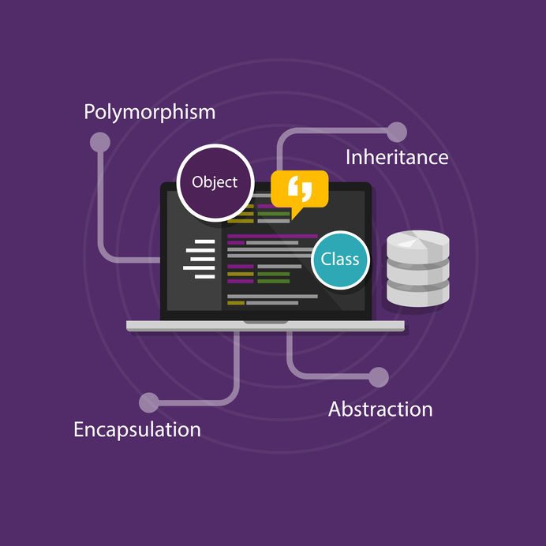
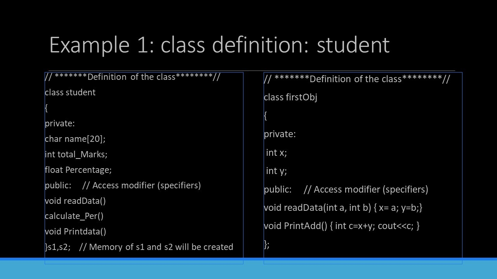
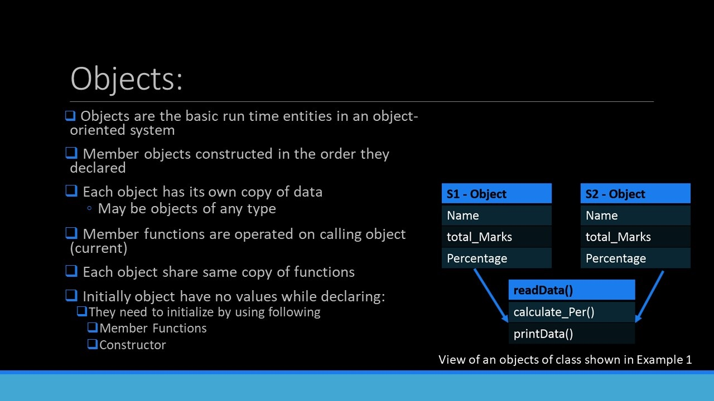
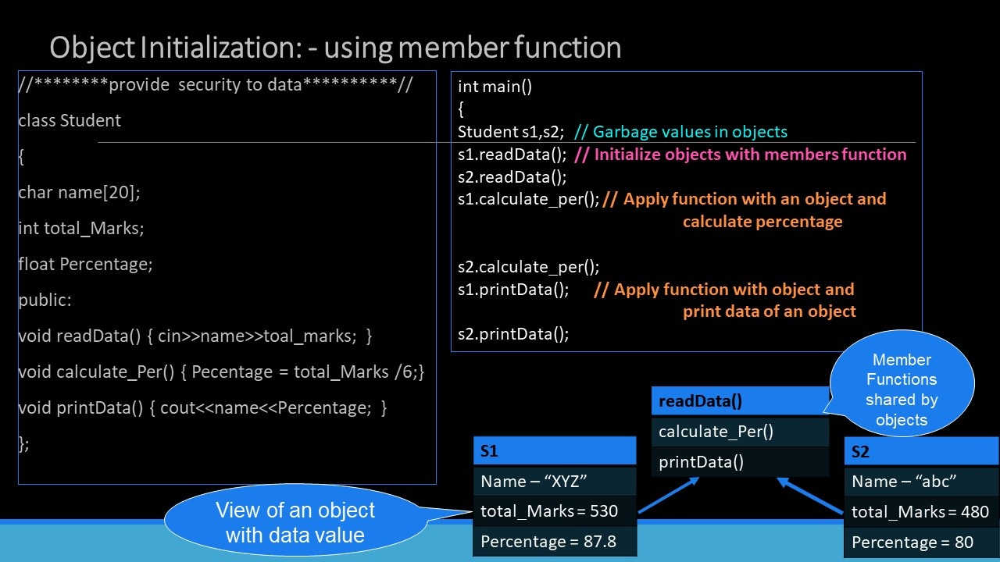

# Object Oriented Programming

Is a programming paradigm in which programs are organized around data, or based on the concept "objects", rather than functions and logic.

Basically an object can be defined as a data (attributes or properties) and behaviors (methods)

Simply put, OOP focuses on the objects that developers want to manipulate rather than the logic required to manipulate them. This approach to programming is well-suited for programs that are large, complex and actively updated or maintained. Due to the organization of an object-oriented program, this method is also conducive to collaborative development where projects can be divided into groups. Additional benefits of OOP include code reusability, scalability and efficiency.

OOP was developed to increase the reusability and maintainability of source code. Transparent representation of the control flow had no priority and was meant to be handled by a compiler. With the increasing relevance of parallel hardware and multithreaded coding, developing transparent control flow becomes more important, something hard to achieve with OOP

## Principles of OOP

## 

- ### TABLE OF CONTENT:

```
   1.Introduction
   2.Objects
   3.Class
   4.Encapsulation
   5.Abstraction
   6.Inheritance
   7.Polymorphism
```

- ## Join The team To Watch the Session (42j02g8)
- ## [Session](https://cisuezedu.sharepoint.com/sites/TROSE/_layouts/15/stream.aspx?id=%2Fsites%2FTROSE%2FShared%20Documents%2FOOP%20with%20cpp%2FRecordings%2FMeeting%20in%20_OOP%20with%20c%2B%2B_-20221219_190510-Meeting%20Recording.mp4)
- ## [Oop Comic](https://www.facebook.com/GDSCSuezCanalUniversity/photos/482295073245315)

---

- # Introduction to OOP :
  - ## Articles
    - ### [C++](https://www.geeksforgeeks.org/object-oriented-programming-in-cpp/#intro)
    - ### [Java](https://www.geeksforgeeks.org/classes-objects-java/)
  - ## Videos
    - ### [Concept](https://youtu.be/fK2lLVqc8UY)
    - ### [C++](https://youtu.be/2ZIrInD95Us)
    - ### [Java](https://youtu.be/FaaM6uVbuJM)
- ### Characteristics of an Object Oriented Programming

<pre>

         
 </pre>

---

- # Class and Object in C++ :

  - **Objects**

    - Are the basic runtime entities in an OOP, They may represent person or place, etc...

    - Compination of data and programs that are represent real world entity
    - The basic idea behind OOP approach is to compine both data and functions into a single unit.

    - An object consists of:

      - **State** : It is represented by attributes of an object. It also reflects the properties of an object.
      - **Behavior** : It is represented by methods of an object. It also reflects the response of an object with other objects.
      - **Identity** : It gives a unique name to an object and enables one object to interact with other objects.

  - **Class**:

    - A group of objects that share common props for data and some program part.

    - They are used to represent entities or concepts
    - Each object created from a class is called an instance of the class
    - Has methods (Performs a task)
    - It has attributes, by convention they must be private
    - The name must begin with a capital letter

    _Anothe dif_

    - A class is a user defined blueprint or prototype from which objects are created. It represents the set of properties or methods that are common to all objects of one type. In general, class declarations can include these components, in order:

      - **Modifiers**: A class can be public or has default access (Refer this for details).
      - **Class name**: The name should begin with a initial letter (capitalized by convention).
      - **Superclass**(if any): The name of the class’s parent (superclass), if any, preceded by the keyword extends. A class can only extend (subclass) one parent.
      - **Body**: The class body surrounded by braces, { }.

### Access Modifier:

Defines access type of the method i.e. from where it can be accessed in your application. In Java, there 4 type of the access specifiers.

- **public**: accessible in all class in your application.
- **protected**: accessible within the package in which it is defined and in its subclass(es)(including subclasses declared outside the package)
- **private**: accessible only within the class in which it is defined.
- **default** (declared/defined without using any modifier): accessible within same class and package within which its class is defined.

  _Note_

  #### Static class:

  - No need to create instances to call them
  - Only static methods can be called

### Example with images





```c++
class person
{
    char name[20];
    int id;
public:
    void getdetails(){}
};

int main()
{
   person p1; // p1 is a object
}
```

---

- # Encapsulation :


---


---
The wrapping up of data and functions into a single unit. It's use concept of data hidding.

It's make data hide/not accessible to the outside world . Those functions where are wrapped in the class can access it. (The functions provide interface between objs and program).

In other words, encapsulation is a programming technique that binds the class members (variables and methods) together and prevents them from being accessed by other classes, thereby we can keep variables and methods safes from outside interference and misuse.

The meaning of Encapsulation, is to make sure that "sensitive" data is hidden from users. To achieve this, you must:

- declare class variables/attributes as private
- provide public get and set methods to access and update the value of a private variable

### Get and Set

You learned that `private` variables can only be accessed within the same class (an outside class has no access to it). However, it is possible to access them if we provide public `get` and `set` methods.

The `get` method returns the variable value, and the `set` method sets the value.

Syntax for both is that they start with either `get` or `set`, followed by the name of the variable, with the first letter in upper case:

```c++
class Person {
  private:
    string name; // private = restricted access

  // Getter
  public:
    string getName() {
        return name; // return the value of the variable name
    }

    // Setter
    void setName(string newName) {
        this.name = newName; // The set method takes a parameter (newName) and assigns it to the name variable
    }
}

```

### Advantage of Encapsulation?

- Better control of class attributes and methods
- Flexible: the programmer can change one part of the code without affecting other parts
- Increased security of data
- The encapsulated code is more flexible and easy to change with new requirements.
- It prevents the other classes to access the private fields.
- Encapsulation allows modifying implemented code without breaking others code who have implemented the code.
- It keeps the data and codes safe from external inheritance. Thus, Encapsulation helps to achieve security.
- It improves the maintainability of the application.


---

- # Another C++ program to explain

```c++
#include<iostream>
using namespace std;

class Encapsulation
{
   private:
       // data hidden from outside world
       int x;

   public:
       // function to set value of
       // variable x
       void set(int a)
       {
           x =a;
       }

       // function to return value of
       // variable x
       int get()
       {
           return x;
       }
};
// main function
int main()
{
   Encapsulation obj;

   obj.set(5);

   cout<<obj.get();
   return 0;
}
```
---
- ## Articles
  - ### [C++](https://www.geeksforgeeks.org/object-oriented-programming-in-cpp/#encapsulation)
  - ### [Java](https://www.geeksforgeeks.org/encapsulation-in-java/)
- ## Videos
  - ### [Concept](https://youtu.be/qP9-3LnMZsE)
  - ### [C++](https://youtu.be/eNtsHReY1Hop)
  - ### [Java](https://youtube.com/playlist?list=PLCInYL3l2AagY7fFlhCrjpLiIFybW3yQv)

---

# Abstraction :

- ## Articles
  - ### [C++](https://www.geeksforgeeks.org/object-oriented-programming-in-cpp/#abstraction)
  - ### [Java](https://www.geeksforgeeks.org/abstraction-in-java-2/)
- ## Videos

  - ### [Concept](https://youtu.be/dW4WhJZB99U)
  - ### [C++](https://youtu.be/JJEYMKVWEuc)
  - ### [Java](https://youtu.be/Kp8o-j4FmF8)

- ## Program to Demonstrate the working of Abstraction :

```c++
#include <iostream>
using namespace std;

class implementAbstraction {
private:
   int a, b;

public:
   // method to set values of
   // private members
   void set(int x, int y)
   {
       a = x;
       b = y;
   }

   void display()
   {
       cout << "a = " << a << endl;
       cout << "b = " << b << endl;
   }
};

int main()
{
   implementAbstraction obj;
   obj.set(10, 20);
   obj.display();
   return 0;
}
```

---

# Inheritance :

- ## Articles
  - ### [C++](https://www.geeksforgeeks.org/object-oriented-programming-in-cpp/#inheritance)
  - ### [Java](https://www.geeksforgeeks.org/inheritance-in-java/)
- ## Videos
  - ### [Concept](https://youtu.be/1XE_cfonjXU)
  - ### [C++ part1](https://youtu.be/zIo__kgxgqo)
  - ### [C++ part 2](https://youtu.be/kg5TIwmxlCc)
  - ### [Java part 1](https://youtu.be/vnzteHmCIg0)
  - ### [Java part 2](https://youtu.be/ltuACF2NCh0)
- # Inheritance in C++ :

   <pre>
           
  </pre>

  ### Syntax:

```c++
class  <derived_class_name> : <access-specifier> <base_class_name>
{
        //body
}
```

## define member function without argument within the class :

```c++
#include<iostream>
using namespace std;

class Person
{
    int id;
    char name[100];

    public:
        void set_p()
        {
            cout<<"Enter the Id:";
            cin>>id;
            fflush(stdin);
            cout<<"Enter the Name:";
            cin.get(name,100);
        }

        void display_p()
        {
            cout<<endl<<id<<"\t"<<name<<"\t";
        }
};

class Student: private Person
{
    char course[50];
    int fee;

    public:
    void set_s()
        {
            set_p();
            cout<<"Enter the Course Name:";
            fflush(stdin);
            cin.getline(course,50);
            cout<<"Enter the Course Fee:";
            cin>>fee;
        }

        void display_s()
        {
            display_p();
            cout<<course<<"\t"<<fee<<endl;
        }
};

main()
{
    Student s;
    s.set_s();
    s.display_s();
    return 0;
}
```

---

## Polymorphism :

- ## Articles
  - ### [C++](https://www.geeksforgeeks.org/object-oriented-programming-in-cpp/#polymorphism)
  - ### [Java](https://www.geeksforgeeks.org/polymorphism-in-java/)
- ## Videos

  - ### [Concept](https://youtu.be/1XE_cfonjXU)
  - ### [C++ part 1](https://youtu.be/5ZoKcGdQt3c)
  - ### [C++ part 2](https://youtu.be/JJEYMKVWEuc)
  - ### [Java part 1](https://youtu.be/bI1vqMrIGlQ)
  - ### [Java part 2](https://youtu.be/kBpkPU0zkNk)

- # Polymorphism in C++ :

 <pre>
         
</pre>

- ## function overloading

```c++
using namespace std;
class Geeks {
public:

   // Function with 1 int parameter
   void func(int x)
   {
       cout << "value of x is " <<
                x << endl;
   }

   // Function with same name but
   // 1 double parameter
   void func(double x)
   {
       cout << "value of x is " <<
                x << endl;
   }

   // Function with same name and
   // 2 int parameters
   void func(int x, int y)
   {
       cout << "value of x and y is " <<
                x << ", " << y << endl;
   }
};

// Driver code
int main()
{
   Geeks obj1;

   // Function being called depends
   // on the parameters passed
   // func() is called with int value
   obj1.func(7);

   // func() is called with double value
   obj1.func(9.132);

   // func() is called with 2 int values
   obj1.func(85, 64);
   return 0;
}
```

### C++ program for function overriding

```c++
#include <bits/stdc++.h>
using namespace std;

class base {
public:
    virtual void print()
    {
        cout << "print base class" <<
                 endl;
    }

    void show()
    {
      cout << "show base class" <<
               endl;
    }
};

class derived : public base {
public:

    // print () is already virtual function in
    // derived class, we could also declared as
    // virtual void print () explicitly
    void print()
    {
        cout << "print derived class" <<
                 endl;
    }

    void show()
    {
      cout << "show derived class" <<
               endl;
    }
};

// Driver code
int main()
{
    base* bptr;
    derived d;
    bptr = &d;

    // Virtual function, binded at
    // runtime (Runtime polymorphism)
    bptr->print();

    // Non-virtual function, binded
    // at compile time
    bptr->show();

    return 0;
}
```

---
